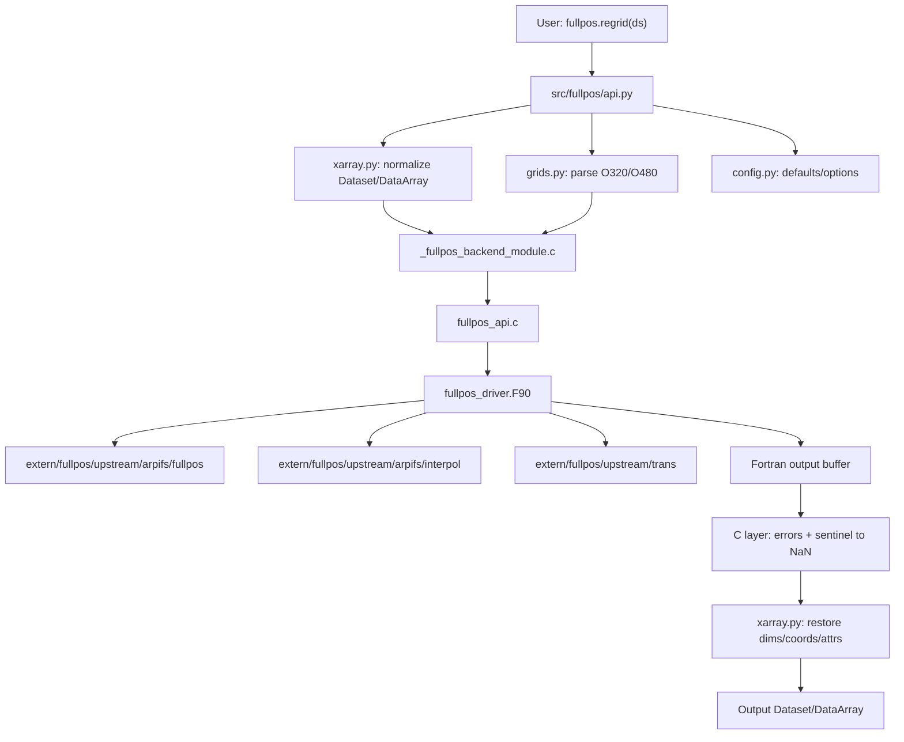

# FullPos Independent Python Package Implementation Plan

## Decision

`fullpos` should be developed as an independent Python package dedicated to
ECMWF/OpenIFS/ERA5-style data processing.

`F:/PythonPackage/FullPos/` is the local development workspace. The package
import should remain:

```python
from fullpos import regrid
```

not:

```python
from skyborn.fullpos import regrid
```

The package should use the development workspace root directly:

```text
F:/PythonPackage/FullPos/
  extern/
    fullpos/
      README.fullpos.md
      UPSTREAM_REVISION.txt
      NOTICE
      LICENSES/
      upstream/
        arpifs/
          fullpos/
          interpol/
          module/
        trans/
        contrib/
      patches/
        0001-fullpos-build-shims.patch

  src/
    fullpos/
      __init__.py
      api.py
      xarray.py
      grids.py
      config.py
      errors.py
      meson.build

      native/
        fullpos_driver.F90
        fullpos_types.F90
        fullpos_api.c
        fullpos_api.h
        _fullpos_backend_module.c
```

The target development layout is:

```text
F:/PythonPackage/FullPos/
```

## Why Independent Package

Keep `fullpos` independent because:

- it is specialized for ECMWF/OpenIFS/ERA5-style data
- FULLPOS/OpenIFS source provenance and license notes are heavy enough to deserve
  their own package boundary
- Fortran/C build complexity should not be forced into Skyborn's core package
- future users should be able to install only this ECMWF-focused tool
- Skyborn can later depend on it optionally if needed

Skyborn integration can be added later as an adapter:

```python
try:
    from fullpos import regrid as fullpos_regrid
except ImportError:
    fullpos_regrid = None
```

## Default Development Environment

Use the existing `skyborn_dev` environment by default for development:

```powershell
conda activate skyborn_dev
```

When an explicit interpreter is needed:

```powershell
F:\Anaconda3\envs\skyborn_dev\python.exe
```

Common commands:

```powershell
cd F:\PythonPackage\FullPos

F:\Anaconda3\envs\skyborn_dev\python.exe -m pip install -e . --no-build-isolation
F:\Anaconda3\envs\skyborn_dev\python.exe -m pytest -q tests
F:\Anaconda3\envs\skyborn_dev\python.exe -m build --wheel
```

The default environment is still `skyborn_dev`.

## Target Public API

Minimal V1 API:

```python
from fullpos import regrid

out = regrid(
    ds,
    source_grid="O320",
    target_grid="O480",
    method="linear",
)
```

DataArray example:

```python
from fullpos import regrid

u480 = regrid(
    ds["u"],
    source_grid="O320",
    target_grid="O480",
)
```

Supported in V1:

- ECMWF/OpenIFS/ERA5-style data
- xarray `Dataset` and `DataArray`
- octahedral Gaussian grids such as `O320` and `O480`
- `O320 -> O480`
- scalar horizontal regridding
- `method="linear"`
- output missing values represented as `NaN`

Not supported in V1:

- complete FULLPOS namelist workflow
- GRIB writing
- vertical interpolation
- pressure-level products
- isentropic-level products
- full spectral transform workflow
- all FULLPOS physical diagnostics

## Package Layout

Recommended repository layout:

```text
F:/PythonPackage/FullPos/
  pyproject.toml
  meson.build
  README.md
  environment.yml
  .gitignore

  extern/
    fullpos/
      README.fullpos.md
      UPSTREAM_REVISION.txt
      NOTICE
      LICENSES/
      upstream/
        arpifs/
          fullpos/
          interpol/
          module/
        trans/
        contrib/
      patches/
        0001-fullpos-build-shims.patch

  src/
    fullpos/
      __init__.py
      api.py
      xarray.py
      grids.py
      config.py
      errors.py
      _version.py
      native/
        fullpos_driver.F90
        fullpos_types.F90
        fullpos_api.c
        fullpos_api.h
        _fullpos_backend_module.c

  tests/
    test_api.py
    test_grids.py
    test_backend.py
    test_xarray.py
    test_realdata.py

  docs/
    api.md
    grids.md
    validation.md
```

## Source Ownership Boundary

### `extern/fullpos/`

This directory stores upstream source and provenance.

Rules:

- keep upstream source headers intact
- record upstream commit/version/date in `UPSTREAM_REVISION.txt`
- record copied directories in `README.fullpos.md`
- keep license/notice material under `LICENSES/` and `NOTICE`
- keep package-specific changes under `patches/`
- treat `extern/fullpos/upstream/` as a read-only upstream mirror

Do not put package-owned C/Python wrappers inside `extern/fullpos/upstream/`.

### `src/fullpos/`

This directory stores the maintained Python package.

Responsibilities:

- public API
- xarray input/output handling
- grid descriptor parsing
- configuration and errors
- import of compiled backend
- missing-value normalization to `NaN`

### `src/fullpos/native/`

This directory stores package-owned C/Fortran shims.

Responsibilities:

- `_fullpos_backend_module.c`: CPython/NumPy extension module
- `fullpos_api.c`: C wrapper around Fortran symbols
- `fullpos_api.h`: C declarations, symbol macros, error codes
- `fullpos_driver.F90`: minimal Fortran driver calling selected upstream logic
- `fullpos_types.F90`: package-owned small types/constants

## Architecture Diagram



## Build Strategy

Use `meson-python` with a handwritten CPython/NumPy C extension and Fortran
backend. This follows the same engineering style as Skyborn's `spharm/ectrans`
native backend, but the package remains independent.

Do not use f2py/`.pyf` as the default interface strategy.

Reasons:

- C extension gives explicit Python ABI control
- C layer can handle NumPy validation and error messages cleanly
- Fortran layer can stay focused on numerical kernels
- generated f2py ABI churn is avoided
- it is easier to wrap selected FULLPOS routines gradually

## Reference `pyproject.toml`

```toml
[build-system]
requires = [
    "meson-python>=0.16",
    "meson>=1.3",
    "ninja",
    "numpy>=1.24",
]
build-backend = "mesonpy"

[project]
name = "fullpos"
version = "0.1.0"
description = "ECMWF/OpenIFS FULLPOS-style regridding tools for Python"
readme = "README.md"
authors = [{ name = "Qianye Su" }]
requires-python = ">=3.9"
dependencies = [
    "numpy>=1.24",
    "xarray",
]
classifiers = [
    "Development Status :: 3 - Alpha",
    "Intended Audience :: Science/Research",
    "Topic :: Scientific/Engineering :: Atmospheric Science",
    "Programming Language :: Python :: 3",
    "Programming Language :: Fortran",
]

[project.optional-dependencies]
io = [
    "netCDF4",
    "h5netcdf",
]
grib = [
    "cfgrib",
]
dev = [
    "pytest",
    "pytest-cov",
    "build",
]
```

## Reference `meson.build`

Top-level `meson.build`:

```meson
project(
  'fullpos',
  ['c', 'fortran'],
  version: '0.1.0',
  default_options: ['warning_level=2', 'buildtype=release', 'b_lto=false'],
)

py_mod = import('python')
py = py_mod.find_installation(pure: false)
py_dep = py.dependency()

incdir_numpy_cmd = run_command(
  py,
  ['-c', 'import numpy; print(numpy.get_include())'],
  check: true,
)
inc_np = include_directories(incdir_numpy_cmd.stdout().strip())

py.install_sources(
  [
    'src/fullpos/__init__.py',
    'src/fullpos/api.py',
    'src/fullpos/xarray.py',
    'src/fullpos/grids.py',
    'src/fullpos/config.py',
    'src/fullpos/errors.py',
  ],
  subdir: 'fullpos',
)

backend_ext = py.extension_module(
  '_fullpos_backend',
  [
    'src/fullpos/native/_fullpos_backend_module.c',
    'src/fullpos/native/fullpos_api.c',
    'src/fullpos/native/fullpos_driver.F90',
    'src/fullpos/native/fullpos_types.F90',
    # Later: explicitly add selected sources from extern/fullpos/upstream/.
  ],
  include_directories: inc_np,
  dependencies: [py_dep],
  c_args: ['-DNPY_NO_DEPRECATED_API=NPY_1_19_API_VERSION'],
  fortran_args: ['-O3'],
  install: true,
  install_dir: get_option('python.purelibdir') / 'fullpos',
  build_by_default: true,
)
```

When upstream FULLPOS files are needed, list each source explicitly. Avoid
automatic globbing over the full upstream tree.

## Development Environment

Use `skyborn_dev` by default:

```yaml
name: skyborn_dev
channels:
  - conda-forge
  - defaults
dependencies:
  - python>=3.9
  - numpy
  - xarray
  - netcdf4
  - h5netcdf
  - libblas=*=*openblas
  - liblapack=*=*openblas
  - gfortran
  - gcc
  - pkg-config
  - meson
  - meson-python
  - ninja
  - pytest
  - pytest-cov
  - build
  - pip
```

Optional ECMWF/GRIB dependencies:

```yaml
  - eccodes
  - cfgrib
```

## Step-by-Step Implementation Path

This is the concrete order to implement the package. Each step should leave the
repository in a runnable state before moving to the next one.

### Step 0: Confirm The Working Root

Working root:

```powershell
cd F:\PythonPackage\FullPos
conda activate skyborn_dev
```

Use this interpreter for explicit commands:

```powershell
F:\Anaconda3\envs\skyborn_dev\python.exe
```

Expected root-level files after setup:

```text
F:\PythonPackage\FullPos
  pyproject.toml
  meson.build
  environment.yml
  README.md
  .gitignore
  extern/
  src/
  tests/
```

Validation:

```powershell
F:\Anaconda3\envs\skyborn_dev\python.exe --version
```

### Step 1: Create The Python Package Skeleton

Create:

```text
src/fullpos/__init__.py
src/fullpos/api.py
src/fullpos/config.py
src/fullpos/errors.py
```

Minimal `src/fullpos/__init__.py`:

```python
from .api import regrid

__all__ = ["regrid"]
```

Minimal `src/fullpos/api.py`:

```python
def regrid(
    obj,
    *,
    source_grid=None,
    target_grid=None,
    method="linear",
    variables=None,
    missing_value=None,
    keep_attrs=True,
):
    if target_grid is None:
        raise ValueError("target_grid is required")
    raise NotImplementedError("FullPos backend is not connected yet")
```

Validation:

```powershell
F:\Anaconda3\envs\skyborn_dev\python.exe -m pip install -e . --no-build-isolation
F:\Anaconda3\envs\skyborn_dev\python.exe -c "from fullpos import regrid; print(regrid)"
```

Success criteria:

- `from fullpos import regrid` works.
- `regrid(..., target_grid=None)` gives a clear `ValueError`.
- No compiled backend is required yet.

### Step 2: Add Packaging Files

Create or update:

```text
pyproject.toml
meson.build
environment.yml
.gitignore
README.md
```

At this step, `meson.build` can install only Python sources. The compiled backend
can be added in Step 5.

Validation:

```powershell
F:\Anaconda3\envs\skyborn_dev\python.exe -m pip install -e . --no-build-isolation
F:\Anaconda3\envs\skyborn_dev\python.exe -m pip show fullpos
```

Success criteria:

- Editable install succeeds.
- Package metadata shows `Name: fullpos`.

### Step 3: Add Upstream Source Provenance

Create:

```text
extern/fullpos/README.fullpos.md
extern/fullpos/UPSTREAM_REVISION.txt
extern/fullpos/NOTICE
extern/fullpos/LICENSES/
extern/fullpos/upstream/
extern/fullpos/patches/
```

Copy selected upstream source directories:

```text
extern/fullpos/upstream/arpifs/fullpos/
extern/fullpos/upstream/arpifs/interpol/
extern/fullpos/upstream/arpifs/module/
extern/fullpos/upstream/trans/
extern/fullpos/upstream/contrib/
```

`UPSTREAM_REVISION.txt` should include:

```text
source: F:\openifs-main
revision: <git commit or local snapshot date>
copied: <date>
copied_by: Qianye Su
```

Validation:

```powershell
Get-Content extern\fullpos\UPSTREAM_REVISION.txt
Get-ChildItem extern\fullpos\upstream
```

Success criteria:

- Upstream source location is documented.
- Copied directories are documented.
- License and notice files are present.
- No package-owned shim code is placed inside `extern/fullpos/upstream/`.

### Step 4: Implement Grid Descriptors

Create:

```text
src/fullpos/grids.py
tests/test_grids.py
```

Minimal responsibilities:

- parse `O320`
- parse `O480`
- reject unsupported grid strings
- expose a deterministic grid descriptor object

Minimal API:

```python
grid = parse_grid("O320")
assert grid.name == "O320"
assert grid.n == 320
assert grid.grid_type == "octahedral"
```

Validation:

```powershell
F:\Anaconda3\envs\skyborn_dev\python.exe -m pytest -q -o addopts= tests\test_grids.py
```

Success criteria:

- `O320` and `O480` parse successfully.
- Invalid names fail with clear `ValueError`.

### Step 5: Add The C Extension Stub

Create:

```text
src/fullpos/native/_fullpos_backend_module.c
src/fullpos/native/fullpos_api.h
```

Expose one method first:

```python
import fullpos._fullpos_backend as backend
backend.backend_info()
```

Expected return can be simple:

```python
{"name": "fullpos", "backend": "c-stub"}
```

Update `meson.build` to build `_fullpos_backend`.

Validation:

```powershell
F:\Anaconda3\envs\skyborn_dev\python.exe -m pip install -e . --no-build-isolation
F:\Anaconda3\envs\skyborn_dev\python.exe -c "import fullpos._fullpos_backend as b; print(b.backend_info())"
```

Success criteria:

- `_fullpos_backend` imports.
- `backend_info()` returns deterministic information.
- No Fortran source is required yet.

### Step 6: Add The Fortran Stub And C Shim

Create:

```text
src/fullpos/native/fullpos_driver.F90
src/fullpos/native/fullpos_types.F90
src/fullpos/native/fullpos_api.c
src/fullpos/native/fullpos_api.h
tests/test_backend.py
```

First Fortran routine can be a deterministic placeholder, for example:

```text
copy input to output
```

or:

```text
fill output with 1.0
```

The goal is to validate the ABI chain:

```text
Python -> C extension -> C shim -> Fortran -> C shim -> Python
```

Validation:

```powershell
F:\Anaconda3\envs\skyborn_dev\python.exe -m pip install -e . --no-build-isolation
F:\Anaconda3\envs\skyborn_dev\python.exe -m pytest -q -o addopts= tests\test_backend.py
```

Success criteria:

- C extension calls Fortran successfully.
- NumPy arrays cross the boundary correctly.
- Fortran error codes become Python exceptions.

### Step 7: Connect `regrid()` To The Backend Stub

Update:

```text
src/fullpos/api.py
src/fullpos/xarray.py
tests/test_api.py
tests/test_xarray.py
```

Responsibilities:

- accept `xarray.DataArray`
- accept `xarray.Dataset`
- select variables if `variables=` is provided
- call `_fullpos_backend`
- rebuild xarray output
- preserve name and attrs when safe
- convert backend sentinels to `NaN`

Validation:

```powershell
F:\Anaconda3\envs\skyborn_dev\python.exe -m pytest -q -o addopts= tests\test_api.py tests\test_xarray.py tests\test_backend.py tests\test_grids.py
```

Success criteria:

- DataArray input returns DataArray.
- Dataset input returns Dataset.
- Unsupported grids/methods fail clearly.
- Missing output is `NaN`.

### Step 8: Replace The Stub With Minimal FULLPOS Logic

Initial numerical target:

```text
source_grid="O320"
target_grid="O480"
method="linear"
scalar fields only
```

Rules:

- explicitly list every upstream source in `meson.build`
- do not glob all files under `extern/fullpos/upstream`
- add one upstream dependency at a time
- document each required upstream source in `extern/fullpos/README.fullpos.md`
- keep package-owned modifications in `src/fullpos/native/` or
  `extern/fullpos/patches/`

Validation:

```powershell
F:\Anaconda3\envs\skyborn_dev\python.exe -m pytest -q -o addopts= tests\test_backend.py tests\test_xarray.py
```

Success criteria:

- constant field remains constant after regrid.
- smooth synthetic field produces finite output.
- missing values stay `NaN`.
- no internal sentinel leaks.

### Step 9: Add Optional Real ECMWF/OpenIFS Validation

Create:

```text
tests/test_realdata.py
```

This test should be skipped by default unless a local data path is configured.

Suggested checks:

- output grid shape matches `O480`
- finite ratio is reasonable
- no sentinel values leak
- constant-field sanity check passes
- compare against a trusted reference if available

Validation:

```powershell
F:\Anaconda3\envs\skyborn_dev\python.exe -m pytest -q -o addopts= tests\test_realdata.py
```

Success criteria:

- real data test runs locally when data exists.
- CI or machines without data skip cleanly.

### Step 10: Build And Smoke-Test A Wheel

Build:

```powershell
F:\Anaconda3\envs\skyborn_dev\python.exe -m build --wheel
```

Smoke test:

```powershell
conda create -n fullpos-wheel-test -c conda-forge python=3.12 numpy xarray netcdf4
conda activate fullpos-wheel-test
python -m pip install dist\fullpos-*.whl
python -c "from fullpos import regrid; print(regrid)"
```

Success criteria:

- wheel builds under `dist/`
- wheel installs into a clean environment
- `from fullpos import regrid` works after wheel install

## Implementation Stages

### Stage 1: Create Package Skeleton

Create:

```text
pyproject.toml
meson.build
src/fullpos/__init__.py
src/fullpos/api.py
src/fullpos/errors.py
src/fullpos/config.py
```

Success check:

```powershell
F:\Anaconda3\envs\skyborn_dev\python.exe -c "from fullpos import regrid; print(regrid)"
```

At this stage `regrid()` can validate arguments and raise `NotImplementedError`.

### Stage 2: Add Upstream Source Provenance

Create:

```text
extern/fullpos/README.fullpos.md
extern/fullpos/UPSTREAM_REVISION.txt
extern/fullpos/NOTICE
extern/fullpos/LICENSES/
extern/fullpos/upstream/
extern/fullpos/patches/
```

Copy selected upstream directories:

```text
extern/fullpos/upstream/arpifs/fullpos/
extern/fullpos/upstream/arpifs/interpol/
extern/fullpos/upstream/arpifs/module/
extern/fullpos/upstream/trans/
extern/fullpos/upstream/contrib/
```

Success criteria:

- source location and revision documented
- copied directory list documented
- license and notice files present
- package-owned shim code is not mixed into upstream directories

### Stage 3: Implement Grid Descriptors

Create:

```text
src/fullpos/grids.py
```

Minimal implementation:

```python
from dataclasses import dataclass


@dataclass(frozen=True)
class OctahedralGaussianGrid:
    name: str
    n: int
    grid_type: str = "octahedral"


def parse_grid(name: str) -> OctahedralGaussianGrid:
    normalized = name.upper()
    if not normalized.startswith("O"):
        raise ValueError("Only octahedral Gaussian grids are supported in V1")
    return OctahedralGaussianGrid(name=normalized, n=int(normalized[1:]))
```

Success checks:

```python
parse_grid("O320")
parse_grid("O480")
```

### Stage 4: Build A C Extension Stub

Create:

```text
src/fullpos/native/_fullpos_backend_module.c
```

Expose:

```python
import fullpos._fullpos_backend as backend
backend.backend_info()
```

Success checks:

```powershell
F:\Anaconda3\envs\skyborn_dev\python.exe -m pip install -e . --no-build-isolation
F:\Anaconda3\envs\skyborn_dev\python.exe -c "import fullpos._fullpos_backend as b; print(b.backend_info())"
```

### Stage 5: Add A Fortran Stub

Create:

```text
src/fullpos/native/fullpos_driver.F90
src/fullpos/native/fullpos_api.c
src/fullpos/native/fullpos_api.h
src/fullpos/native/fullpos_types.F90
```

Validate the chain:

```text
Python -> C extension -> C shim -> Fortran -> C shim -> Python
```

The first Fortran routine can return deterministic placeholder values. The goal
is build-chain validation, not numerical correctness.

### Stage 6: Add xarray Wrapping

Create:

```text
src/fullpos/xarray.py
```

Responsibilities:

- identify horizontal dimensions
- normalize `Dataset` and `DataArray`
- select variables
- call `_fullpos_backend`
- restore dims, coordinates, names, and attrs
- convert all backend missing sentinels to `NaN`

### Stage 7: Replace Stub With Minimal FULLPOS Logic

Initial numerical target:

```text
O320 -> O480
method="linear"
scalar fields
xarray input/output
```

Rules:

- do not compile upstream directories using glob patterns
- explicitly list every upstream source file in `meson.build`
- document why each upstream file is required
- keep package modifications in `src/fullpos/native/` or `extern/fullpos/patches/`
- add a focused test before adding more upstream dependencies

### Stage 8: Add Tests

Suggested tests:

```text
tests/test_api.py
tests/test_grids.py
tests/test_backend.py
tests/test_xarray.py
tests/test_realdata.py
```

Default test command:

```powershell
F:\Anaconda3\envs\skyborn_dev\python.exe -m pytest -q -o addopts= tests
```

Real-data tests should be optional and skipped when local ECMWF/ERA5 files are
not present.

### Stage 9: Build Wheel

Editable install:

```powershell
F:\Anaconda3\envs\skyborn_dev\python.exe -m pip install -e . --no-build-isolation
```

Wheel build:

```powershell
F:\Anaconda3\envs\skyborn_dev\python.exe -m build --wheel
```

Clean install smoke test:

```powershell
conda create -n fullpos-wheel-test -c conda-forge python=3.12 numpy xarray netcdf4
conda activate fullpos-wheel-test
python -m pip install dist\fullpos-*.whl
python -c "from fullpos import regrid; print(regrid)"
```

## Gitignore Guidance

Track:

```text
pyproject.toml
meson.build
environment.yml
README.md
extern/fullpos/README.fullpos.md
extern/fullpos/UPSTREAM_REVISION.txt
extern/fullpos/NOTICE
extern/fullpos/LICENSES/**
extern/fullpos/upstream/**
extern/fullpos/patches/**
src/fullpos/**/*.py
src/fullpos/**/*.c
src/fullpos/**/*.h
src/fullpos/**/*.F90
tests/*.py
docs/*.md
```

Ignore:

```text
build/
dist/
*.egg-info/
.pytest_cache/
.coverage*
htmlcov/
*.pyd
*.so
*.dylib
*.dll
*.lib
*.exp
*.obj
*.o
*.mod
*.smod
data/
scratch/
tmp/
*.nc
*.grib
*.grib2
*.idx
*.zarr/
```

## Recommended Work Order

```text
1. Create package skeleton.
2. Add pyproject.toml, meson.build, environment.yml, .gitignore.
3. Add extern/fullpos provenance files and upstream directories.
4. Implement from fullpos import regrid.
5. Implement O320/O480 grid parser.
6. Add C extension stub.
7. Add Fortran stub and C shim.
8. Build in skyborn_dev.
9. Connect regrid() to backend stub.
10. Add synthetic tests.
11. Replace stub with minimal O320 -> O480 FULLPOS logic.
12. Add optional real-data validation.
13. Build wheel and test clean install.
```

Core principle:

```text
Keep fullpos independent.
Use skyborn_dev as the development environment.
Vendor upstream FULLPOS source under extern/fullpos/upstream.
Build the Python/C/Fortran package boundary first.
Move numerical code in small verified pieces.
```

## Current Stage Gate

The current implemented path is native ECTRANS spectral interpolation for:

```text
O320 or N320 -> O480 or N480
```

with xarray and NumPy frontends, automatic GRIB grid inference for ECMWF
octahedral reduced Gaussian grids, and user-configurable `chunk_size`. The
runtime backend is native OpenIFS/ECTRANS only; there is intentionally no
Skyborn fallback in the interpolation path.

Before starting the next major feature, the current stage must satisfy:

- `F:\Anaconda3\envs\skyborn_dev\python.exe -m pytest -q` passes.
- Real-data `O320 -> O480` works for one layer and all 137 hybrid levels.
- Output shapes and xarray attrs describe the target grid.
- `chunk_size` works for small chunks, `64`, and `None`.
- Full-column `O320 -> O480 -> O320` roundtrip metrics are recorded.
- Per-level roundtrip error metrics are recorded and reviewed.

The current full-column baseline is recorded in `VALIDATION.md`:

```text
137-level O320 -> O480 -> O320
relative_rmse: 0.00461448
rmse: 0.14457
max_abs: 8.52429
total_s: 33.2007
```

This is enough to continue validation work, but not enough to start a larger
feature such as vertical interpolation or GRIB writing. The next immediate task
is per-level error analysis, because the first four levels have much smaller
roundtrip error than the full 137-level column.

Recommended next feature order after this gate is closed:

1. Per-level error report and regression thresholds.
2. Backend diagnostics and clearer error messages.
3. Packaging cleanup for Windows first, then Linux/macOS conditional patches.
4. Dataset multi-variable ergonomics and output metadata cleanup.
5. Only then consider vertical interpolation, GRIB writing, or generic reduced
   Gaussian grids.

Packaging cleanup status:

- Python runtime library discovery is now isolated in `src/fullpos/native.py`.
- Windows uses `extern/fullpos/local/bin` and `.dll` libraries.
- Linux will use `extern/fullpos/local/lib` and `.so` libraries.
- macOS will use `extern/fullpos/local/lib` and `.dylib` libraries.
- `meson.build` no longer unconditionally links Windows-only `ws2_32`.
- `meson.build` supports `-Dfullpos_native_prefix=...`.
- Runtime diagnostics can override the prefix with `FULLPOS_NATIVE_PREFIX`.
- Windows native runtime and doctor checks are validated locally.
- Linux/macOS still need real FIAT/ECTRANS builds before wheel work can be considered complete.

## 2026-05-10 Vertical Reference Note

Pressure-level interpolation is still not wired to native FULLPOS, but the
request-preparation layer is now strong enough to drive an external compiled
reference check.

- Added `tools/skyborn_pressure_reference.py` as a development-only reference
  workflow.
- The tool reuses `prepare_pressure_request(...)`, then converts hybrid
  half-level `A/B` coefficients to model-level midpoints before calling
  `skyborn.interp.interpolation.interp_hybrid_to_pressure`.
- For ERA5-style coefficients, `p0` must be `1.0`, not `100000.0`, because
  ERA5 `hyai/hyam` are pressure-unit `ap` coefficients.
- Real O96 ERA5 validation on `t(time, hybrid, values)` with levels
  `[100000, 85000, 50000]` produced:
  - finite `100000 Pa`: `103890 / 161280`
  - finite `85000 Pa`: `153562 / 161280`
  - finite `50000 Pa`: `161280 / 161280`
- The missing values at `100000 Pa` and part of `85000 Pa` are expected with
  `extrapolate=False`; they are not a bug in the packed reduced-grid handling.

## 2026-05-10 Native FULLPOS Vertical Source Audit

The local `extern/fullpos/upstream` snapshot originally did not contain enough
OpenIFS source to build the real FULLPOS vertical chain. In particular, calls
from `ENDPOS` to `APACHE`, `PPLETA`, `GPHPRE`, `GPGEO`, `GPRCP`, and `GPRH`
could not be resolved inside the vendored tree.

I checked the full local OpenIFS checkout at `F:\openifs-main\ifs-source` and
found the missing official source directories:

- `arpifs/pp_obs`: contains `pos.F90`, `apache.F90`, `ppleta.F90`, and related
  vertical post-processing routines.
- `arpifs/adiab`: contains `gphpre.F90`, `gpgeo.F90`, `gprcp.F90`, `gprh.F90`,
  and related hydrostatic/thermodynamic setup routines.

Those two directories have now been copied into:

```text
extern/fullpos/upstream/arpifs/pp_obs
extern/fullpos/upstream/arpifs/adiab
```

The next implementation step is not Python API work. It is a native build
step:

1. Reproduce OpenIFS interface-header generation for the vendored sources, or
   reuse OpenIFS CMake/ecbuild output.
2. Build a small native vertical library/wrapper that calls the official
   `POS/APACHE` chain for pressure levels.
3. Connect `vertical_interpolate(..., target="pressure")` to that wrapper.
4. Validate against the recorded Skyborn reference and official ERA5
   pressure-level products.
