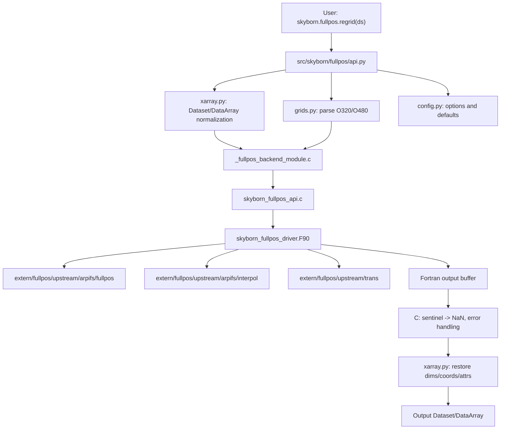

# Skyborn FULLPOS 集成实现计划

## 结论

如果目标是长期服务 Skyborn，并且 FULLPOS 只面向 ECMWF/OpenIFS/ERA5 风格数据使用，那么下面这种结构比独立 `fullpos` 包更合适：

```text
D:/Skyborn/
  extern/
    fullpos/
      README.skyborn.md
      UPSTREAM_REVISION.txt
      NOTICE
      LICENSES/
      upstream/
        arpifs/
          fullpos/
          interpol/
          module/
        trans/
        contrib/
      patches/
        0001-skyborn-build-shims.patch

  src/skyborn/
    fullpos/
      __init__.py
      api.py
      xarray.py
      grids.py
      config.py
      errors.py
      meson.build

      native/
        skyborn_fullpos_driver.F90
        skyborn_fullpos_types.F90
        skyborn_fullpos_api.c
        skyborn_fullpos_api.h
        _fullpos_backend_module.c
```

推荐这个框架的原因：

- `extern/fullpos/upstream/` 可以完整保存 FULLPOS/OpenIFS 相关上游源码，方便追踪来源和许可证。
- `extern/fullpos/patches/` 可以记录 Skyborn 为了构建、裁剪、接口化做过的改动，不直接污染上游源码。
- `src/skyborn/fullpos/` 只放 Skyborn 自己维护的 Python API、xarray 适配和 native 桥接层。
- C/Fortran 编译方式可以参考 `D:\Skyborn\src\skyborn\spharm\ectrans`，避免依赖 f2py/pyf 生成接口。
- 以后如果要拆成独立 `fullpos` wheel，也可以从这个边界反向抽出来。

不建议把 FULLPOS 源码直接散放到 `src/skyborn/fullpos/native/`。更好的做法是：

```text
extern/fullpos/upstream/  保存上游源码
src/skyborn/fullpos/      保存 Skyborn 包装和最小桥接代码
```

也就是说，“整个源码放进去”可以，但应该放在 `extern/fullpos/upstream/`，并且作为只读上游镜像管理。

## 默认开发环境

后续默认使用现有 Skyborn 开发环境：

```powershell
conda activate skyborn_dev
```

如果需要显式调用解释器，默认使用：

```powershell
F:\Anaconda3\envs\skyborn_dev\python.exe
```

常用命令：

```powershell
cd D:\Skyborn

# 只构建 fullpos 子模块，避免全仓库重编译
F:\Anaconda3\envs\skyborn_dev\python.exe -m meson setup src\skyborn\fullpos\build src\skyborn\fullpos --wipe
F:\Anaconda3\envs\skyborn_dev\python.exe -m ninja -C src\skyborn\fullpos\build

# 测试
F:\Anaconda3\envs\skyborn_dev\python.exe -m pytest -q -o addopts= tests\test_fullpos*.py
```

如果沿用 Skyborn 当前 `setup.py` 的 Meson 自动发现机制，只要 `src/skyborn/fullpos/meson.build` 存在，后续可以纳入 Skyborn 的正常构建流程。

## 目标 API

第一阶段目标接口保持简单：

```python
from skyborn.fullpos import regrid

out = regrid(
    ds,
    source_grid="O320",
    target_grid="O480",
    method="linear",
)
```

也可以支持：

```python
import skyborn.fullpos as sfp

out = sfp.regrid(
    ds["u"],
    source_grid="O320",
    target_grid="O480",
)
```

V1 只承诺：

- ECMWF/OpenIFS/ERA5 风格数据
- octahedral Gaussian grid
- `O320 -> O480`
- `method="linear"`
- xarray `Dataset` / `DataArray`
- 输出缺测值为 `NaN`

暂不承诺：

- 完整 FULLPOS namelist 工作流
- GRIB 写出
- 垂直插值
- 等压面 / 等熵面输出
- 谱变换全链路
- 所有 FULLPOS 诊断变量

## 代码框架图



## 目录职责

### `extern/fullpos/`

保存上游来源和 Skyborn 补丁。

```text
extern/fullpos/
  README.skyborn.md
  UPSTREAM_REVISION.txt
  NOTICE
  LICENSES/
  upstream/
  patches/
```

职责：

- 记录 FULLPOS/OpenIFS 来源。
- 记录上游版本、commit、下载时间。
- 保存许可证和 NOTICE。
- 保存 Skyborn patch，而不是直接改乱上游源码。

建议规则：

- `extern/fullpos/upstream/` 尽量当作只读目录。
- 修改通过 `extern/fullpos/patches/*.patch` 记录。
- Skyborn 自己写的接口代码不要放进 upstream。

### `src/skyborn/fullpos/`

保存 Skyborn 对外 API 和编译桥接。

```text
src/skyborn/fullpos/
  __init__.py
  api.py
  xarray.py
  grids.py
  config.py
  errors.py
  meson.build
  native/
```

职责：

- 提供 `skyborn.fullpos.regrid`。
- 管理 xarray 输入输出。
- 管理 grid descriptor。
- 管理错误类型。
- 管理 C/Fortran extension 构建。

### `src/skyborn/fullpos/native/`

保存 Skyborn 自己维护的 C/Fortran shim。

```text
native/
  skyborn_fullpos_driver.F90
  skyborn_fullpos_types.F90
  skyborn_fullpos_api.c
  skyborn_fullpos_api.h
  _fullpos_backend_module.c
```

职责：

- `_fullpos_backend_module.c`：Python C extension，负责 Python/NumPy ABI。
- `skyborn_fullpos_api.c`：C 到 Fortran 的薄封装和符号兼容。
- `skyborn_fullpos_api.h`：C 函数声明、符号宏、错误码。
- `skyborn_fullpos_driver.F90`：调用上游 FULLPOS 最小子集。
- `skyborn_fullpos_types.F90`：Skyborn 自己定义的轻量类型和参数。

## 为什么不是直接编译整个 FULLPOS

可以完整保存源码，但不建议一开始完整编译。

原因：

- FULLPOS 依赖的 OpenIFS 上下文很大，直接编译容易陷入依赖树。
- 很多代码是业务流程、namelist、IO、诊断逻辑，不是 O320 -> O480 的最小路径。
- 一开始完整编译，失败时很难判断是构建问题、ABI 问题、依赖问题还是算法问题。

推荐策略：

```text
完整保存源码
最小选择编译
逐步扩大依赖
每一步都有测试
```

## 实现阶段

### 阶段 1：整理上游源码

目标：把 FULLPOS/OpenIFS 相关源码按来源放进 `extern/fullpos/upstream/`。

建议内容：

```text
extern/fullpos/upstream/arpifs/fullpos/
extern/fullpos/upstream/arpifs/interpol/
extern/fullpos/upstream/arpifs/module/
extern/fullpos/upstream/trans/
extern/fullpos/upstream/contrib/
```

同时创建：

```text
extern/fullpos/README.skyborn.md
extern/fullpos/UPSTREAM_REVISION.txt
extern/fullpos/NOTICE
extern/fullpos/LICENSES/
```

成功标准：

- 能清楚说明源码来自哪里。
- 能清楚说明复制了哪些目录。
- 能清楚说明是否做过修改。

### 阶段 2：建立 Skyborn Python API

目标：先让下面代码能 import：

```python
from skyborn.fullpos import regrid
```

文件：

```text
src/skyborn/fullpos/__init__.py
src/skyborn/fullpos/api.py
src/skyborn/fullpos/errors.py
src/skyborn/fullpos/config.py
```

第一版 `regrid()` 可以只做参数检查，并抛出清晰的 `NotImplementedError`。

成功标准：

```powershell
F:\Anaconda3\envs\skyborn_dev\python.exe -c "from skyborn.fullpos import regrid; print(regrid)"
```

### 阶段 3：实现 grid descriptor

目标：支持：

```python
parse_grid("O320")
parse_grid("O480")
```

文件：

```text
src/skyborn/fullpos/grids.py
```

建议数据结构：

```python
from dataclasses import dataclass


@dataclass(frozen=True)
class OctahedralGaussianGrid:
    name: str
    n: int
    grid_type: str = "octahedral"
```

后续再补：

- 纬向行数
- 每个纬圈的经向点数
- packed offset
- north-to-south ordering

### 阶段 4：打通 C extension stub

目标：先构建一个 `_fullpos_backend`，不调用真实 FULLPOS。

文件：

```text
src/skyborn/fullpos/native/_fullpos_backend_module.c
src/skyborn/fullpos/meson.build
```

先暴露一个最小函数：

```python
import skyborn.fullpos._fullpos_backend as backend
backend.backend_info()
```

成功标准：

```powershell
F:\Anaconda3\envs\skyborn_dev\python.exe -m ninja -C src\skyborn\fullpos\build
F:\Anaconda3\envs\skyborn_dev\python.exe -c "import skyborn.fullpos._fullpos_backend as b; print(b.backend_info())"
```

### 阶段 5：打通 C -> Fortran stub

目标：让 C extension 调用 Skyborn 自己写的 Fortran stub。

文件：

```text
src/skyborn/fullpos/native/skyborn_fullpos_driver.F90
src/skyborn/fullpos/native/skyborn_fullpos_api.c
src/skyborn/fullpos/native/skyborn_fullpos_api.h
```

Fortran stub 可以先做最简单的数组复制或填充值。

成功标准：

```text
Python -> C extension -> Fortran stub -> C extension -> Python
```

这条链可以传入 NumPy 数组并返回 NumPy 数组。

### 阶段 6：接入 xarray 包装

目标：`regrid()` 可以接受 `DataArray` 和 `Dataset`。

文件：

```text
src/skyborn/fullpos/xarray.py
src/skyborn/fullpos/api.py
```

职责：

- 识别水平维度。
- 提取数值数组。
- 调 `_fullpos_backend`。
- 重建 xarray 对象。
- 保留 attrs/name。
- 输出缺测保持 `NaN`。

### 阶段 7：替换 Fortran stub 为 FULLPOS 最小路径

目标：只接入 `O320 -> O480, method="linear"` 需要的最小 FULLPOS 子集。

策略：

- 不从完整 FULLPOS driver 开始。
- 从插值 kernel 和网格描述开始。
- 每加一个上游 Fortran 文件，就记录为什么需要。
- 每加一个依赖，就补一个最小测试。

记录文件：

```text
extern/fullpos/README.skyborn.md
extern/fullpos/patches/0001-skyborn-build-shims.patch
```

### 阶段 8：真实数据验证

目标：用 ECMWF/ERA5/OpenIFS 风格数据验证。

最小验证：

```python
from skyborn.fullpos import regrid

out = regrid(
    ds,
    source_grid="O320",
    target_grid="O480",
    method="linear",
)
```

检查：

- 输出 shape 是否符合 O480。
- 坐标是否正确。
- 常数场是否仍为常数。
- smooth field 是否无明显异常。
- 缺测是否仍为 `NaN`。
- 不泄漏内部 sentinel。

真实数据测试应该默认 skip，只有本地数据存在时才运行。

## Meson 构建建议

`src/skyborn/fullpos/meson.build` 参考 `spharm/ectrans`：

```meson
project(
  'skyborn-fullpos-backend',
  ['c', 'fortran'],
  version: '0.1.0',
  default_options: ['warning_level=2', 'buildtype=release', 'b_lto=false'],
)

py_mod = import('python')
py = py_mod.find_installation(pure: false)
py_dep = py.dependency()

incdir_numpy_cmd = run_command(
  py,
  ['-c', 'import numpy; print(numpy.get_include())'],
  check: true,
)
inc_np = include_directories(incdir_numpy_cmd.stdout().strip())

backend_ext = py.extension_module(
  '_fullpos_backend',
  [
    'native/_fullpos_backend_module.c',
    'native/skyborn_fullpos_api.c',
    'native/skyborn_fullpos_driver.F90',
    'native/skyborn_fullpos_types.F90',
    # Later add selected upstream FULLPOS sources here.
  ],
  include_directories: inc_np,
  dependencies: [py_dep],
  c_args: ['-DNPY_NO_DEPRECATED_API=NPY_1_19_API_VERSION'],
  fortran_args: ['-O3'],
  install: true,
  install_dir: get_option('python.purelibdir') / 'skyborn' / 'fullpos',
  build_by_default: true,
)
```

后续如果需要从 `extern/fullpos/upstream/` 编译上游源码，可以在 `meson.build` 中显式列出文件，不建议用 glob 自动全收。

## 测试布局

建议新增：

```text
tests/test_fullpos_api.py
tests/test_fullpos_grids.py
tests/test_fullpos_backend.py
tests/test_fullpos_xarray.py
tests/test_fullpos_realdata.py
```

测试顺序：

1. `test_fullpos_grids.py`：测试 `O320/O480` 解析。
2. `test_fullpos_api.py`：测试参数校验。
3. `test_fullpos_backend.py`：测试 C/Fortran stub。
4. `test_fullpos_xarray.py`：测试 DataArray/Dataset 包装。
5. `test_fullpos_realdata.py`：本地真实数据测试，默认 skip。

默认命令：

```powershell
F:\Anaconda3\envs\skyborn_dev\python.exe -m pytest -q -o addopts= tests\test_fullpos_api.py tests\test_fullpos_grids.py tests\test_fullpos_backend.py tests\test_fullpos_xarray.py
```

## 是否还能独立打包成 wheel

可以，但如果采用这个 Skyborn vendored 框架，第一目标就不是 `pip install fullpos`，而是：

```powershell
pip install skyborn
```

或者本地开发：

```powershell
cd D:\Skyborn
F:\Anaconda3\envs\skyborn_dev\python.exe -m pip install -e . --no-build-isolation
```

后续如果需要独立包，可以从：

```text
src/skyborn/fullpos/
extern/fullpos/
```

抽出成：

```text
src/fullpos/
extern/fullpos/
```

因为 `src/skyborn/fullpos/` 已经是清晰边界，所以迁移成本可控。

## 推荐实施顺序

```text
1. 创建 extern/fullpos 元数据和 upstream 目录
2. 创建 src/skyborn/fullpos Python 空包
3. 实现 regrid() 参数校验
4. 实现 grids.py: O320/O480 parser
5. 添加 _fullpos_backend C extension stub
6. 添加 Fortran stub
7. 接入 meson.build 并在 skyborn_dev 中构建
8. 让 regrid() 调 backend stub
9. 加 synthetic tests
10. 从 FULLPOS 逐步接入 O320 -> O480 最小 Fortran 依赖
11. 本地真实 ECMWF 数据验证
12. 记录上游来源、patch 和许可证
```

关键原则：

- 先打通构建链，再搬数值代码。
- 上游源码完整保存，但不要一开始完整编译。
- 所有 Skyborn 修改都放在 shim 或 patch 里。
- 输出缺测统一是 `NaN`。
- 默认开发和测试环境是 `skyborn_dev`。

